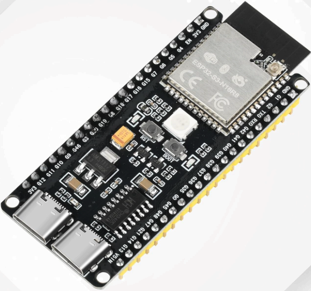
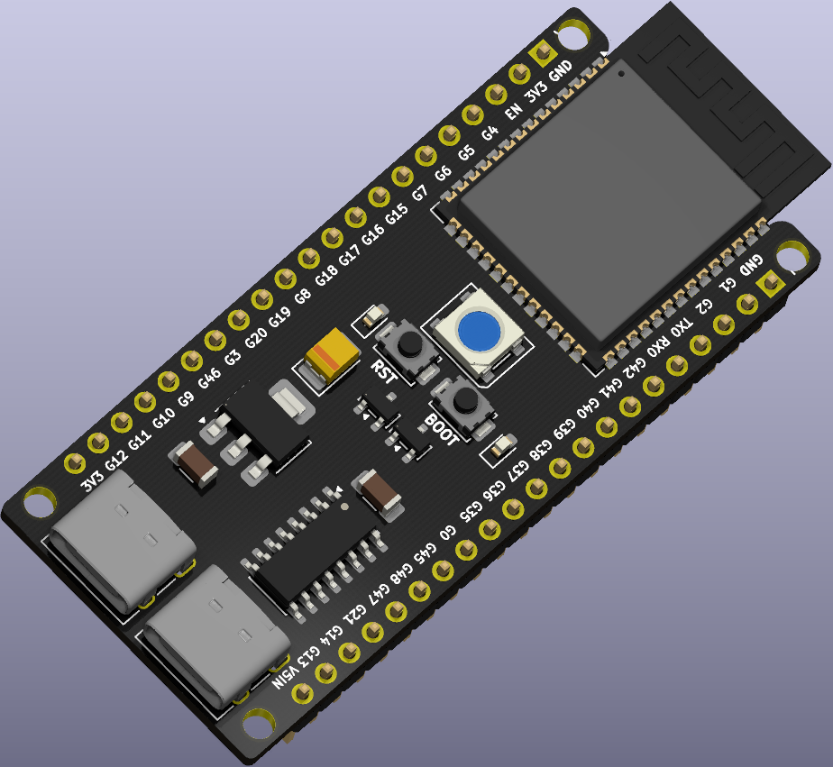
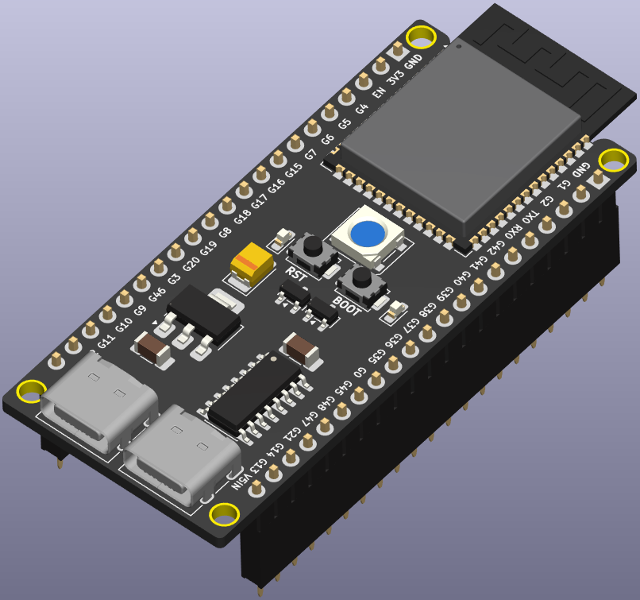
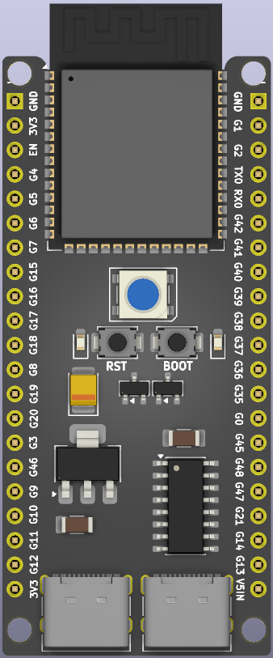
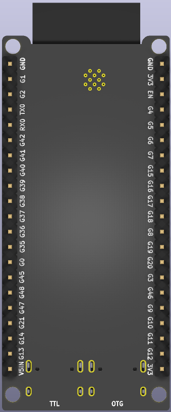
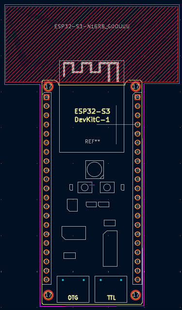
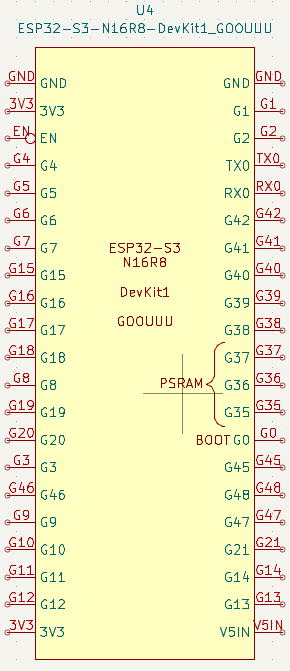
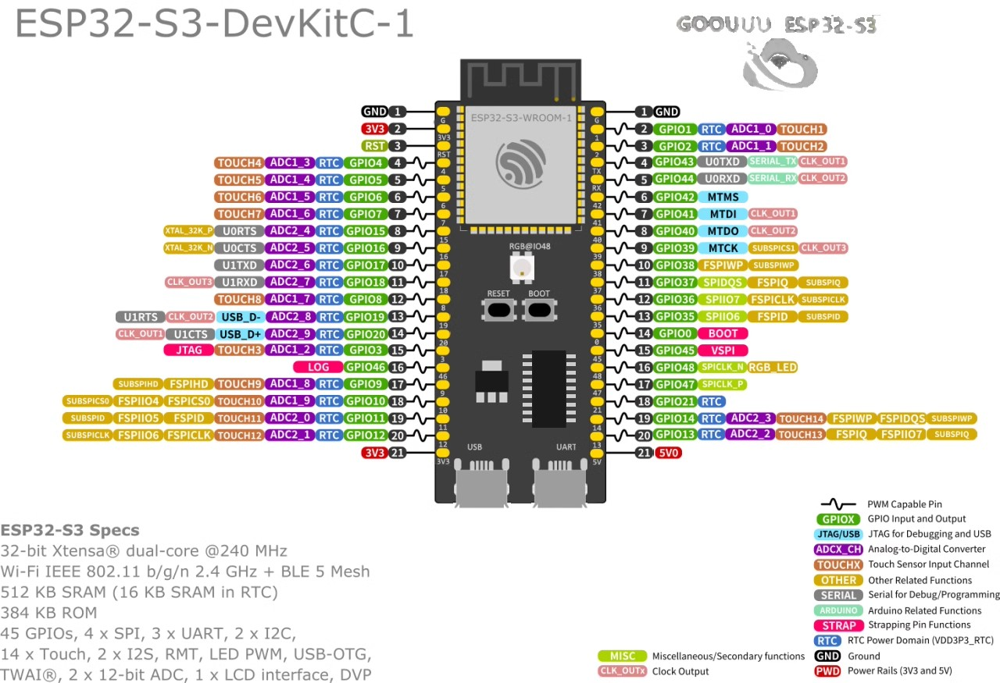

# ESP32-S3_N16R8_DevKit_GOOUUU

<p align="center">
  
</p>

<p align="center">
  
</p>

---

## Overview

This repository collects all hardware design resources related to the **GOOUUU ESP32-S3 N16R8 DevKitC-1**, created because no complete public reference for this board was available online.

The goal of this repository is to centralize electronic, mechanical, and firmware-related assets required for:

- Hardware integration
- Firmware development
- Custom PCB design
- Enclosure design
- Documentation reference

All files are organized to provide a single source of truth for developers working with this specific board variant.

---

## Full KiCAD Library

**KiCAD Version Used : 10.0.1-2**

The directory "**KiCAD_Lib_ESP32-S3**" contains these files of the Board :
- **3D_CAD**
- **Footprint**
- **SymbolSchematic**

You can just add the directory "**KiCAD_Lib_ESP32-S3**" wherever you want in your device and than update the "fp-lib-table", the "sym-lib-table" and then choose the right 3D file of the board.
(Tip : It is recommended to use **Relatives paths** insted of Absolutes paths. To do this make sure to write ***${KIPRJMOD}/../*** at the start of the directories names if you'll include the library in the project folder)

**How To Do It**

- **Copy-Paste** the "KiCAD_Lib_ESP32-S3" directory wherever you want, e.g. in your KiCAD project directory and remember or copy this new path.

- **Open** your KiCAD project (File name : ***yourPrjName.kicad_pro***)

- To add the **Schematic** to the "sym-lib-table" : ***Preferences*** -> ***Manage Symbol Libraries*** -> ***Project Specific Libraries*** (or the *Global Libraries* if you prefer) -> click **+** -> Give it a name and choose the path of the ***KiCAD_Lib_ESP32-S3/SymbolSchematic/ComponentsLibraryESP32-S3.kicad_sym*** directory.

- To add the **Footprint** to the "fp-lib-table" : ***Preferences*** -> ***Manage Footprints Libraries*** -> ***Project Specific Libraris*** (or the *Global Libraries* if you prefer) -> click **+** -> Give it a name and choose the path of the ***KiCAD_Lib_ESP32-S3/Footprint/ESP32-S3-N16R8_GOOUUU.pretty*** directory.

---

## 3D Models

Contains mechanical models of the board used for enclosure design and mechanical integration.

- `STEP` files — CAD models compatible with Fusion360, SolidWorks, FreeCAD, and similar software.

Typical use cases:

- mounting alignment
- mechanical integration
- project visualization

Two variants of the 3D model are provided:

<p align="center">
  
  
</p>

<p align="center">
  <em><strong>Left: board only — Right: board with socket headers allowing module removal</em>
</p>

---

### Top and Bottom Views

<p align="center">
  
  
</p>

<p align="center">
  <em><strong>Left: top view of the board — Right: bottom view of the board</em>
</p>

---

## PCB Footprints

Library footprints representing the **GOOUUU ESP32-S3 N16R8 DevKitC-1 module**.

Includes:

- PCB land patterns
- pin definitions
- mechanical outlines
- pin labeling
- USB Type-C identification (**OTG** or **TTL/UART**)

These footprints are intended for reuse in custom PCB designs and mechanical integrations.

<p align="center">
  
</p>

<p align="center">
  <em><strong>TODO: add board components to the footprint</em>
</p>

---

## PCB Schematics

Schematic symbol exposing all available board pins for direct integration into custom designs.

<p align="center">
  
</p>

---

## Hardware Design Notes

Some pins require special attention because improper usage may cause boot failures or unstable behavior.

The ESP32-S3 uses **strapping pins**, which define the boot configuration during power-up.

Avoid connecting external devices that force these pins HIGH or LOW during reset.

### Relevant strapping pins

- **GPIO0** — Boot pin. Hold LOW to enter download (bootloader) mode.  
  Normally not required unless firmware prevents flashing.

- **GPIO3** — JTAG-related pin.  
  The ESP32-S3 includes a built-in USB-JTAG debugger accessible directly via the USB-C port.  
  PlatformIO configuration guide:  
  https://community.platformio.org/t/how-to-use-jtag-built-in-debugger-of-the-esp32-s3-in-platformio/36042

- **GPIO45** — May interfere with SPI devices during flashing if externally driven.

- **GPIO46** — UART log output used for:
  - `printf()`
  - `ESP_LOGx`
  - ROM boot messages
  - panic handler output
  - crash dumps
  - firmware flashing

<p align="center">
  
</p>

<p align="center">
  <em><strong>Board pinout reference</em>
</p>

---

## PCB Routing (TODO)

A routing reference found online is included for documentation purposes:

https://github.com/ManuelRandazzo/ESP32-S3_N16R8_DevKit_GOOUUU/tree/main/RepoFiles/images/DevKitRouting.png

The KiCad project is available in this repository.  
Contributions improving the routing are welcome.

---

## PlatformIO and Pioarduino Board Configuration
### PlatformIO Board Configuration
Original Author of this configuration : https://github.com/sivar2311/ESP32-PlatformIO-Flash-and-PSRAM-configurations.

CUSTOM Config -> **flash_mode** from "opi" to "qio" to be coerent with the pioarduino configuration
```ini
; Flash: 16MB OT, PSRAM: 8MB OT
[env:esp32-s3-devkitc-1]
platform = espressif32
board = esp32-s3-devkitc-1
framework = arduino

board_build.arduino.memory_type = opi_opi
board_build.flash_mode = qio ; CUSTOM -> before was "opi"
board_build.psram_type = opi
board_upload.flash_size = 16MB
board_upload.maximum_size = 16777216
board_build.partitions = default_16MB.csv
board_build.extra_flags = 
  -DBOARD_HAS_PSRAM
  -mfix-esp32-psram-cache-issue
```

---

### Pioarduino Board Configuration (PlatformIO Fork)
Original Author of this configuration : https://github.com/sivar2311/platformio_boards/blob/main/esp32-s3-devkitc1-n16r8.json
```ini
; Flash: 16MB OT, PSRAM: 8MB OT
[env:esp32-s3-devkitc1-n16r8]
platform = https://github.com/pioarduino/platform-espressif32/releases/download/stable/platform-espressif32.zip
framework = arduino
board = esp32-s3-devkitc1-n16r8
board_build.extra_flags = 
  -mfix-esp32-psram-cache-issue
```

---

### Add Builtin Debugger for PlatformIO and Pioarduino Fork via Native USB (OTG)
Under the previously configured "board_build.extra_flags" add :
```ini
; Debugger setup link: https://community.platformio.org/t/how-to-use-jtag-built-in-debugger-of-the-esp32-s3-in-platformio/36042
debug_tool = esp-builtin
build_type = debug
debug_load_mode = modified ; To recompile only the most recent changes (faster than recompile all files)
;debug_init_break = thb setup ; OPTIONAL : Change it to start the debugger from the function that you prefer, default is function "main"
```

---

### Add Firmware Flashing, Debugging and Logging PlatformIO and Pioarduino Fork
The ESP32-S3 has a builtin **USB Serial/JTAG Controller ROM bootloader** over native USB (port labeled as OTG) which is used to do multiple tasks such as flashing the firmware, debugging, logging and other things using just one USB 2.0 port.

> [!WARNING]
> When using the USB CDC, the USB OTG will no longer be available.

Under the previously configured "board_build.extra_flags" add :
```ini
; Debugger setup link: https://community.platformio.org/t/how-to-use-jtag-built-in-debugger-of-the-esp32-s3-in-platformio/36042
debug_tool = esp-builtin
build_type = debug
debug_load_mode = modified ; To recompile only the most recent changes (faster than recompile all files especially the external libraries)
;debug_init_break = thb setup ; OPTIONAL : Change it to start the debugger from the function that you prefer, default is function "main"

; Serial port redirected to USB CDC instead of UART
build_flags =
    -D ARDUINO_USB_MODE=1 ; Select the USB CDC (Communication Device Class) instead of UART ---> WARNING : USB OTG is no longer available
    -D ARDUINO_USB_CDC_ON_BOOT=1 ; Automatically opens the serial port after the firmware upload
```

<p>
  <em><strong>Note : Debugging sessions can coexist with logging via USB CDC</em>
</p>

---

## Arduino Board Configuration

**Board selection**
```C
ESP32S3 Dev Module
```
**Configuration reference:**
https://www.reddit.com/r/esp32/comments/1h09gyy/how_to_configure_esp32_s3_n16r8_in_arduino_ide/

---

## Usage

You are free to use, clone, modify, and integrate the content of this repository.

Suggestions and improvements are welcome.

---

## Legal Notice

This project is not affiliated with, endorsed by, or sponsored by GOOUUU Tech.

KiCad schematic symbols and PCB layouts were independently created by Manuel Randazzo based on visual inspection and reverse engineering of the GOOUUU ESP32-S3 N16R8 DevKit module.

GOOUUU Tech remains the manufacturer and owner of the original hardware design.

This repository exists for educational and community purposes only.
If requested by GOOUUU Tech, the repository contents will be removed.
